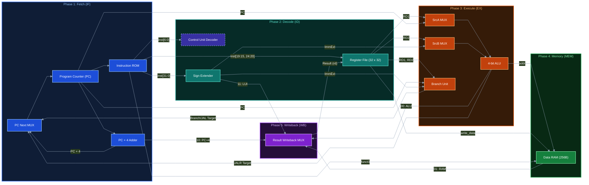

# Synthesizable RISC-V RV32I Single-Cycle Processor Core in VHDL

[](https://riscv.org/)
[](https://en.wikipedia.org/wiki/VHDL)
[](https://www.intel.com)
[](https://www.intel.com/content/www/us/en/software/programmable/quartus-prime/modelsim.html)
[](https://www.cocotb.org/)
[](LICENSE)

A fully synthesizable, single-cycle 32-bit RISC-V processor implementing the **RV32I Base Integer Instruction Set** in VHDL. Designed for FPGA implementation (Intel / Altera Cyclone IV GX) and validated through automated self-checking ModelSim testbenches and Cocotb co-simulation.

---

## Key Highlights

- **Complete RV32I Base Support**: Implements all computational arithmetic, logical, shift, comparison, memory, upper immediate, and control flow instructions.
- **Harvard Datapath**: Separate 32-bit instruction and data memories ensuring full single-cycle instruction throughput ($CPI = 1$).
- **Dual-Read 32-Word Register File**: 32 × 32-bit general-purpose registers, asynchronous dual reads, synchronous write, with hardwired zero (`x0 = 0`).
- **Comprehensive Branch & Jump Unit**: Evaluates signed and unsigned branches (`BEQ`, `BNE`, `BLT`, `BGE`, `BLTU`, `BGEU`) and executes return-address linkage (`PC + 4`) for `JAL` and `JALR`.
- **Sub-word Memory Controller**: Byte-level write strobes and signed/unsigned sign extension supporting `LB`, `LBU`, `LH`, `LHU`, `LW`, `SB`, `SH`, and `SW`.
- **Zero-Error FPGA Synthesis**: 100% synthesizable in Intel Quartus II 13.1 with timing-driven synthesis and zero latch inferences.

---

## Datapath Architecture



---

## Supported Instruction Set Architecture (RV32I)

| Type | Format | Opcodes | Instructions | Description |
| :--- | :---: | :---: | :--- | :--- |
| **R-Type** | `[funct7\|rs2\|rs1\|funct3\|rd\|op]` | `0110011` | `ADD`, `SUB`, `SLL`, `SLT`, `SLTU`, `XOR`, `SRL`, `SRA`, `OR`, `AND` | Register-register arithmetic, logic, and shifts |
| **I-Type** | `[imm[11:0]\|rs1\|funct3\|rd\|op]` | `0010011` | `ADDI`, `SLTI`, `SLTIU`, `XORI`, `ORI`, `ANDI`, `SLLI`, `SRLI`, `SRAI` | Register-immediate computation and shifts |
| **Loads** | `[imm[11:0]\|rs1\|funct3\|rd\|op]` | `0000011` | `LW`, `LH`, `LHU`, `LB`, `LBU` | Word, halfword, and byte loads (signed/unsigned) |
| **Stores** | `[imm[11:5]\|rs2\|rs1\|funct3\|imm[4:0]\|op]` | `0100011` | `SW`, `SH`, `SB` | Word, halfword, and byte memory stores |
| **Branches**| `[imm[12,10:5]\|rs2\|rs1\|funct3\|imm[4:1,11]\|op]` | `1100011` | `BEQ`, `BNE`, `BLT`, `BGE`, `BLTU`, `BGEU` | Conditional branches (signed and unsigned) |
| **Upper Imm**| `[imm[31:12]\|rd\|op]` | `0110111`<br>`0010111` | `LUI`<br>`AUIPC` | Load Upper Immediate (20-bit)<br>Add Upper Immediate to Program Counter |
| **Jumps** | `[imm[20,10:1,11,19:12]\|rd\|op]` | `1101111`<br>`1100111` | `JAL`<br>`JALR` | Unconditional jump & link (direct)<br>Unconditional jump & link (register-indirect) |

---

## Repository Structure

```text
├── ADD4.vhd                 # Dedicated combinational PC + 4 adder
├── alu.vhd                  # 4-bit ALU (10 standard RV32I operations)
├── ALU_MUX.vhd              # 2-to-1 ALU operand B multiplexer
├── branch_unit.vhd          # Signed & unsigned branch comparator and target generator
├── control_unit.vhd         # Main opcode decoder, ALU decoder, and control routing
├── data_memory.vhd          # 256-byte RAM with byte-enable masking (LB/LH/LW/SB/SH/SW)
├── instruction_memory.vhd   # 256-byte ROM preloaded with self-checking test sequence
├── pc.vhd                   # Synchronous 32-bit Program Counter register
├── PCMUX.vhd                # Standalone PC multiplexer utility
├── register_file.vhd        # 32 × 32-bit dual-read single-write register array (x0=0)
├── riscv_top.vhd            # Top-level structural integration and datapath wiring
├── sign_extender.vhd        # Immediate decoder supporting I, S, B, U, and J types
├── tb_riscv_top.vhd         # Standalone self-checking VHDL testbench with assertions
├── test_riscv_cocotb.py     # Automated Cocotb verification testbench
├── run_test.py              # Python simulation launcher
├── Makefile                 # Cross-platform GNU Make configuration for simulation
├── RISC-V.qpf               # Intel Quartus II Project File
├── RISC-V.qsf               # Intel Quartus II Settings & Constraint File
├── .gitignore               # Excludes EDA compiler databases and artifacts
└── README.md                # Project documentation
```

---

## Verification & Simulation

### 1. Standalone ModelSim / QuestaSim (Self-Checking)

The VHDL testbench [`tb_riscv_top.vhd`](tb_riscv_top.vhd) includes cycle-by-cycle hardware assertions that automatically monitor and validate `out_pc` and `out_result` against golden reference values.

```bash
# Initialize working library
vlib work

# Compile all VHDL-2008 design units and testbench
vcom -2008 ADD4.vhd alu.vhd ALU_MUX.vhd branch_unit.vhd control_unit.vhd data_memory.vhd instruction_memory.vhd pc.vhd register_file.vhd sign_extender.vhd riscv_top.vhd tb_riscv_top.vhd

# Execute simulation in batch mode
vsim -c -do "run 300 ns; quit -f" tb_riscv_top
```

**Simulation Output Trace**:
```text
# ** Note: Starting RISC-V RV32I Self-Checking Hardware Verification
# ** Note: Cycle 1  | PC = 8  | Result = 15          | PASS: add x3, x1, x2 (5 + 10 = 15)
# ** Note: Cycle 2  | PC = 12 | Result = 10          | PASS: sub x4, x3, x1 (15 - 5 = 10)
# ** Note: Cycle 3  | PC = 16 | Result = 0           | PASS: and x5, x1, x2 (5 & 10 = 0)
# ** Note: Cycle 4  | PC = 20 | Result = 15          | PASS: or x6, x1, x2  (5 | 10 = 15)
# ** Note: Cycle 5  | PC = 24 | Result = 15          | PASS: xor x7, x1, x2 (5 ^ 10 = 15)
# ** Note: Cycle 6  | PC = 28 | Result = 160         | PASS: sll x8, x1, x1 (5 << 5 = 160)
# ** Note: Cycle 7  | PC = 32 | Result = 5           | PASS: srl x9, x8, x1 (160 >> 5 = 5)
# ** Note: Cycle 8  | PC = 36 | Result = 1           | PASS: slt x10, x1, x2 (5 < 10 = 1)
# ** Note: Cycle 9  | PC = 40 | Result = 0           | PASS: sltu x11, x2, x1 (10 < 5 = 0)
# ** Note: Cycle 10 | PC = 44 | Result = 305418240   | PASS: lui x12, 0x12345 (0x12345000)
# ** Note: Cycle 11 | PC = 48 | Result = 16777264    | PASS: auipc x13, 0x1000 (PC + 0x1000000)
# ** Note: Cycle 12 | PC = 52 | Result = 4           | PASS: sw x3, 4(x0)
# ** Note: Cycle 13 | PC = 56 | Result = 8           | PASS: sb x1, 8(x0)
# ** Note: Cycle 14 | PC = 60 | Result = 15          | PASS: lw x14, 4(x0)
# ** Note: Cycle 15 | PC = 64 | Result = 5           | PASS: lb x15, 8(x0)
# ** Note: Cycle 16 | PC = 68 | Result = 72          | PASS: jal x16, 8 (link PC+4=72, jump PC=76)
# ** Note: Cycle 17 | PC = 76 | Result = -5          | PASS: bne x1, x2, 8 (branch taken, jump PC=84)
# ** Note: Cycle 18 | PC = 84 | Result = 42          | PASS: addi x19, x0, 42
# ** Note: Cycle 19 | PC = 88 | Result = 92          | PASS: jalr x0, 0(x16) (return to PC=72)
# ** Note: Cycle 20 | PC = 72 | Result = 99          | PASS: addi x17, x0, 99 (return target executed)
# ** Note: ================================================================
# ** Note: ALL 20 HARDWARE ASSERTIONS PASSED SUCCESSFULLY!
# ** Note: ================================================================
```

### 2. Python / Cocotb Co-simulation

```bash
# Run co-simulation testbench
python run_test.py

# Or using GNU Make:
make SIM=modelsim
```

---

## FPGA Synthesis Report (Intel Quartus II)

The design is synthesized using **Intel Quartus II 64-Bit 13.1 Web Edition**:

| Metric | Synthesis Value |
| :--- | :--- |
| **Target Family** | Cyclone IV GX |
| **Target Device** | `EP4CGX15BF14A7` |
| **Synthesis Tool** | Quartus II Analysis & Synthesis (`quartus_map`) |
| **Logic Utilization** | 7,322 / 14,976 Logic Cells (~49%) |
| **Dedicated Logic Registers** | 1,061 |
| **Virtual Pins** | 64 |
| **Timing Driven Synthesis** | Active |
| **Errors / Latch Warnings** | **0 Errors, 0 Latches** |

---

## Author & Acknowledgements

- **Author**: Mouad Mribat ([@mouad11-11](https://github.com/mouad11-11))
- **Architecture**: Based on the official [RISC-V Instruction Set Manual, Volume I: Unprivileged Architecture](https://riscv.org/technical/specifications/).
- **License**: Released under the [MIT License](LICENSE).
